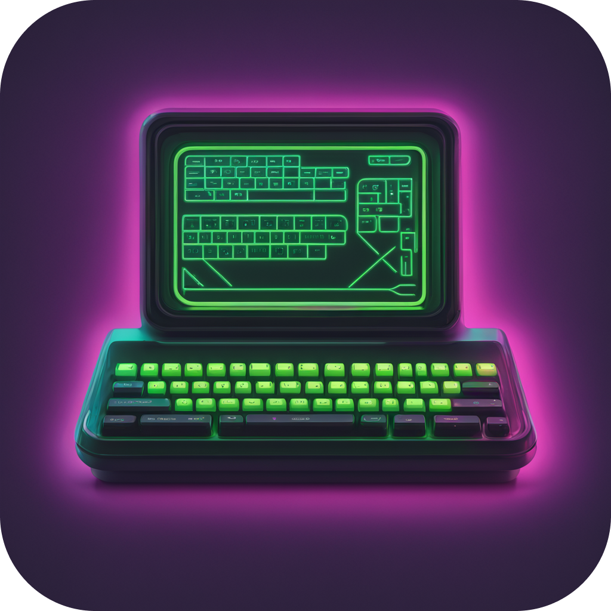

<p align="center">
  
 <h1 align="center">Stackium</h1>
</p>
<p align="center">
 
<a href="https://github.com/dotjulia/stackium/actions/workflows/main.yml"></a>
</p>

## Stackium

A debugger for students to learn pointer and memory layout more intuitively


### Running the debugger

Usage: `stackium [OPTIONS] <PROGRAM>`


```rust
Arguments: <PROGRAM> - the binary file to debug

Options:
* -m, --mode <MODE> [default: cli] [possible values: cli, web, gui]
* -h, --help        Print help
* -V, --version     Print version
```

Launch with `-m web` to expose the API on port `8080`. Have a look at the [crate::prompt::Command][__link0] struct for documentation on the API or inspect the JSON Schema on `/schema` (or in the [schema.json][__link1]) or `/response_schema`.


 [__cargo_doc2readme_dependencies_info]: ggGkYW0BYXSEGwG6I5S0NKmPG3o4DthgIWBvG-Jksq9r3HoIG1XCUZShph89YXKEG-IkrbFGdTnGG6n_GUFOEY3PG6HUqCvaSuH2G62LBwBt1frGYWSBgmhzdGFja2l1bWUwLjEuMA
 [__link0]: https://docs.rs/stackium/0.1.0/stackium/?search=prompt::Command
 [__link1]: ./schema.json
