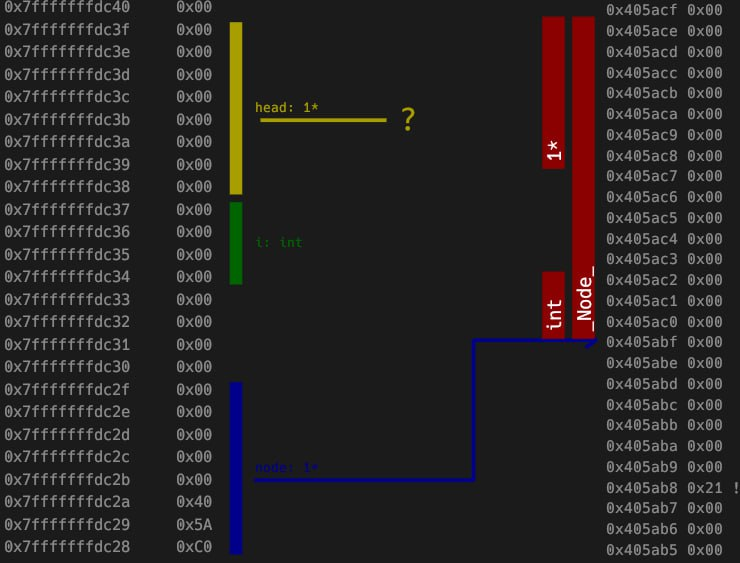

include::partials/header.adoc[]

[.text-left]
== Basic Example
Suppose we want to debug this example program saved in file `test.c`:
[source,c]
----
void swap(int* a, int* b)
{
  int tmp = *a;
  *a = *b;
  *b = tmp;
}


int main()
{
  int first = 3;
  int second = 5;
  swap(&first, &second);
  return 0;
}
----
Let's build it using `./build_test.sh test.c` and then launch stackium in web mode: `./stackium test --mode web`.

After following the URL in the terminal, we can see the following:

image::stackium_first.png[Stackium Web Interface]

Now, click on the `Code` window and set breakpoints on all lines by clicking on the circles to the left of them:

[open.imgcols]
====
--
Breakpoints are denoted by filled circles. When the program gets to a line marked as a breakpoint it stops and you can inspect it.

You can verify that the breakpoints have been set by looking at the breakpoint window:

image:breakpoint_window.png[Breakpoint Window]
--

====

[open.imgcols]
====
Now click on continue in the controls window (sometimes in gui mode you'll need to click it twice when launching the program for the first time). You can see that the first breakpoint has been hit by the green highlight.

image::first_breakpoint.png[First Breakpoint]
====

[open.imgcols]
====
--
Open the memory view by clicking the toggle next to `Memory` in the sidebar to find out what is happening behind the scenes.

IMPORTANT: The memory view builds up over time but the GUI doesn't render new frames automatically. If the memory view doesn't seem to update, try moving the mouse cursor. GitHub Issue: https://github.com/dotjulia/stackium/issues/20


As you can see, the program allocated memory on the stack for the variable `first` and `second`. Looking at the content, you'll find that they don't have the correct value yet. This is because the program was interrupted before the first line in the main function.
--
image::stackium_startmemory.png[Memory View]
====

[open.imgcols]
====
--
Click on `continue` until we reach the swap function and you'll see that `first` and `second` now contains `3` and `4`. Before we step into the swap function, let's tick the `Lock stack start` checkbox.

It is recommended to do this for such short examples in order to get a better overview. The default behaviour of the memory view is to always try and fit the left stack column to the stack of the current function. By locking the stack start we can see that the stack of the `swap` function is appended to the end of the stack of the `main` function.

At the end there will be a screenshot of how it would have looked like if we did not lock the start of the stack to the stack of the main function.
--
--
image::stackium_integers.png[Content of first and second]
image::stackium_lockstackstart.png[Lock Stack Start]
--
====

[open.imgcols]
====
--
If we press continue now, we can see that in the swap function we have two pointers which point into the stack of the main function.

Now try to observe on your own what happens when you step through the swap function.
--
image::stackium_swap.png[Swap Function]
====

[open.imgcols]
====
--
If we didn't lock the stack to the main function's stack, this is what the swap function would have looked like.

As you can see, only the stack of the swap function is displayed and the pointers `a` and `b` now point to a `[stack]` section in the right column.

The right column always tries to load memory which is pointed to by variables on the stack and dynamically updates based on the pointer's values.

In this case, the stack of the main function is loaded on the right side so you can see what is going on.

We can also see that the `calling base pointer` points to the beginning of the stack of the main function.
--
image::stackium_final.png[]
====

[.text-left]
== Linked List Example
Consider the following example program:
[source,c]
--
include::graph.c[]
--
We have a struct `Node` which contains a pointer to another `Node` and an integer value. In the main function we have a variable `head` which points to the first element of the linked list. At the beginning we set this to the `NULL` pointer.

We read from `stdin` how many nodes we want to create and then iterate over them. For each node we allocate memory on the heap and set the `next` pointer to the head of the linked list. Then we set the head to the newly created node. Meaning that the new node is now the first element of the linked list.

Finally, we iterate over the linked list again and print the values of each node.

Let's build it using `./build_test.sh graph.c` and then launch stackium in web mode: `./stackium graph --mode web`. After opening the URL in a browser, let's set a breakpoint on the line with the for loop in the main function and press continue.


You can see, that the control window displays a spinning loading icon. This is because the program is waiting for input from stdin. Let's enter `3` in the terminal and press enter.


The spinning icon is gone and we can see that we hit the breakpoint. If you look at the memory view, you can see that the variable `head` is set to `NULL` and the stack is empty. Let's create the first node by setting the next breakpoint in the loop and pressing continue.

[.imgcols]
--


--

We can see that the `node` pointer points to a `[heap]` section in the memory view. This is because we allocated memory on the heap using `malloc`. If you look at the right column, you can see that a Node struct was allocated and the `next` pointer points to the `NULL` pointer. This is because we set the `next` pointer to the head of the linked list which is `NULL` at the moment.

[.imgcols]
--
[open]
====
Let's open the graph view by clicking on the `Graph` toggle in the sidebar.
After opening it you'll see the following:

In the graph view every variable (also variables that will only be initialized later) is represented by a node. You can drag nodes by holding the left mouse button while hovering over them. Now move the `_Node_*` that is connected to the `_Node_` node to get a better overview.
====


--
TIP: In the current version of stackium, nodes in the graph view also contain the name of the variable they represent (if they have one). This is useful if you want to find a specific variable in the graph view.

[.imgcols]
--
After reorganizing the graph view, it should look like this:


--

Let's set a breakpoint on the `head = node;` line and press continue a few times until we hit it in the next iteration of the loop.

TIP: If you used all the breakpoints mentioned, it should be 3 times.

[.imgcols]
--
[open]
====
We can now see the following in the graph view:

We have two pointers referencing the same node. This is because the `head` pointer points to the first element of the linked list and the `node` pointer points to the newly created node which is now the first element of the linked list.
====


--

After one more iteration of the loop, the graph view will look like this:

[.text-center]


[.imgcols]
--
We can also observe how printing the linked list works. To do that, let's set a breakpoint on the `printf` line and press continue until we hit it.


--

Suddenly, we have three pointers pointing to the same node. This is because the `head` pointer, the previous `node` pointer and the current `node` pointer points to the first element of the linked list.

[.text-center]


We can see that this is the case when we continue to the next iteration of the loop.

[.text-center]


The loop iteration variable `node` is now pointing to the second element of the linked list. The `head` pointer and the previous `node` pointer still point to the first element of the linked list.
Additionally, in the console we see the value of the first element of the linked list.
```bash
30
```

Continuing to the next iteration of the loop, we can see that the `node` pointer now points to the third element of the linked list.

[.text-center]

Output:
```bash
30 20
```

WARNING: If you're confused on why we always see the value of the node in the console one iteration later, this is because the breakpoint being on the `printf` line means that the program is interrupted before `printf` is called. This means that the value of the node is printed after the program continues to the next iteration of the loop.

At the end of the program we can observe the following output in the console:

```bash
30 20 10
```

We can also inspect the linked list in the memory view to see that the `head` pointer points to the first element of the linked list and the `node` pointer points to the last element of the linked list.

[.text-center]


[.text-left]
== Finding Memory Errors with Stackium
Stackium can also be used to easily see memory errors in your program. Let's consider the following example program:
[source,c]
--
include::error.c[]
--

In this example we define an array on the stack, define a pointer to its first element and then iterate over it by incrementing the pointer.

Let's set a breakpoint on the last line of the while loop and press continue until we hit it.

image::img/error_start.png[Error breakpoint]

We can see that the `current_element` pointer points to the first element of the array and the int contains the value `0xABC`. Let's continue to the next iteration of the loop.


As we can see, the `current_element` pointer now points to the second element of the array. Let's look at another iteration of the loop.


Skip a few iterations of the loop and we can see that the `current_element` pointer now points to the last element of the array and all the elements have been set to `0xABC`:

image::img/error_lastelement.png[Last element]

After clicking continue one more time, we can see that the program accesses the array out of bounds:


We found our memory error and can fix it by reducing the number of iterations in the while loop by one. This can be done by iterating until `current_element < numbers + NUMBER_COUNT` instead of `current_element <= numbers + NUMBER_COUNT`.
