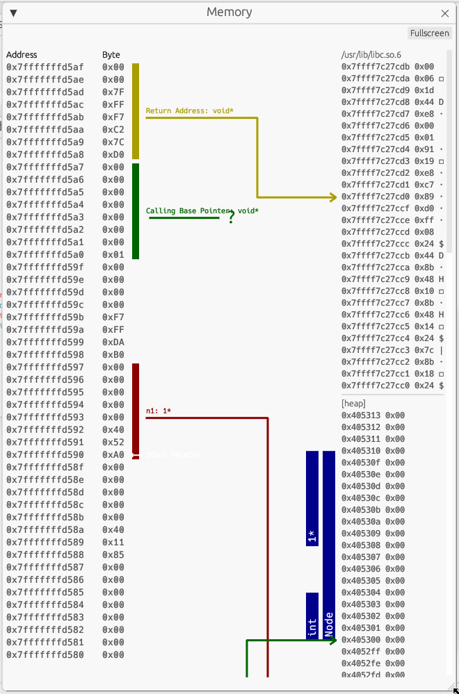

include::partials/header.adoc[]

[.text-left]
[[memoryview]]
== Memory View
[open.imgcols]
====
--
The data is split into two columns.

The left column represents the current stack with the corresponding addresses and bytes. The highest address is at the top and the smallest at the bottom.

The current stack is always just the stack used by the currently executing function. The stack starting address can be locked by ticking the `lock stack` checkbox.

The right column displays additionally loaded memory sections which got loaded by references in the stack.

These additionally loaded sections could be heap, library code loaded by the return pointer, other parts of the stack which are not part of the left column, …
--

====
WARNING: Variables on the right side are discovered by following pointers from the stack with the assumption that they contain meaningful data if they point to a valid memory region.
It is up to the user to confirm that variables on the heap contain the expected data.

[open.imgcols]
====
--
Variables are represented by vertical lines

Structs and arrays consist of multiple vertical lines. The first one representing the memory of the struct and all others to the right being a member variable.

Arrays consist of one line representing the whole array and additionally one for each item.

[open.imgcols]
======
image::memoryview_pointers.png[Pointers]
[open]
=======
Pointers are represented by lines connecting the pointer to the memory it points to.

If the value of the pointer is not within a loaded section, a questionmark is drawn instead.
=======
======

--
[.smaller]
image::memoryview_struct.png[Struct]
====
WARNING: The value of the pointer being within a valid memory region doesn't imply that it points to meaningful data.

WARNING: Due to optimization freed memory is often still within valid memory regions which means pointers to that memory location are still rendered. To avoid this set your pointers to `NULL` after freeing them (this is also a good way to avoid bugs).
