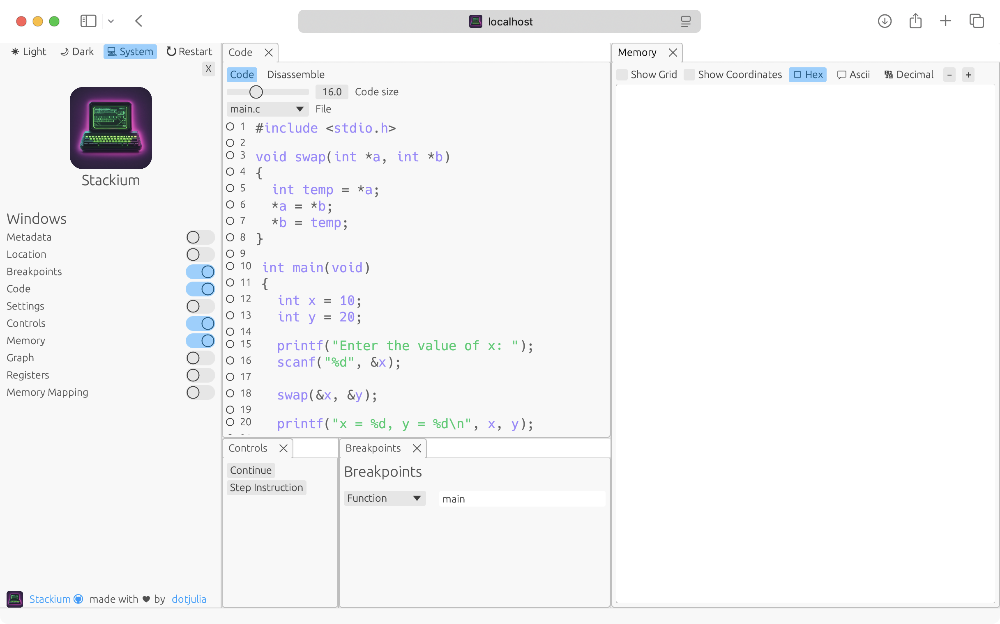

include::partials/header.adoc[]

[.text-left]
== Installation
You can download stackium on the link:https://github.com/dotjulia/stackium/releases/latest[Github release page].

.File Overview
* `build_test.sh` - you always need this file to compile your program with the necessary `clang` flags stackium requires.
* `stackium` - the default stackium binary. Download this file if you are on a recent linux distribution.
* `stackium_static` - a statically linked stackium binary. Download this file if the default binary does not work on your system.
* `stackium_aarch64` - use this binary if you are on an ARM machine (e.g. recent Apple Silicon machines)

[open.imgcols]
====

Place the source file you want to debug into a directory together with the correct stackium binary and the `build_test.sh` script.
Test

[source,bash]
----
22.3 MiB 📁 debug_example
22.3 MiB ├─ 📀 stackium
 4.0 KiB ├─ 👷 build_test.sh
 4.0 KiB └─ 🅲 main.c
----
====

[.text-left]
== Starting the debugger

To debug your code with stackium, you will first need to compile your program with the necessary flags. This is done by running the `build_test.sh` script.
Afterwards, you can run your program with stackium by passing the path to the binary as an argument.

WARNING: Stackium currently requires the binary and source files to be in the same directory.

If you are using macOS without a Linux VM, please follow the additional steps below.

[%collapsible]
.Additional steps for ARM/macOS users
====
- Install Docker Desktop
- In your terminal change the directory to the one containing the stackium binary and source file
- Run the following command to start a Docker container with the necessary environment:

[source,bash]
----
❯ docker run -ti -v $(pwd):/usr/src/project  --privileged -p 8080:8080 --platform=linux/aarch64 ubuntu:latest sh -c "cd /usr/src/project && /bin/bash"
$ DEBIAN_FRONTEND=noninteractive apt update && apt install clang -y
----

(note that `$` indicates the command is run inside the Docker container)

====

[source,raw]
----
❯ chmod +x stackium build_test.sh
❯ ./build_test.sh main.c
❯ ./stackium main
Child pid: 4681
Child running in "debug_example"
API available at localhost:8080
UI available at http://localhost:8080/index.html
----

You can now open your browser and navigate to `http://localhost:8080/index.html` to start debugging your program.

