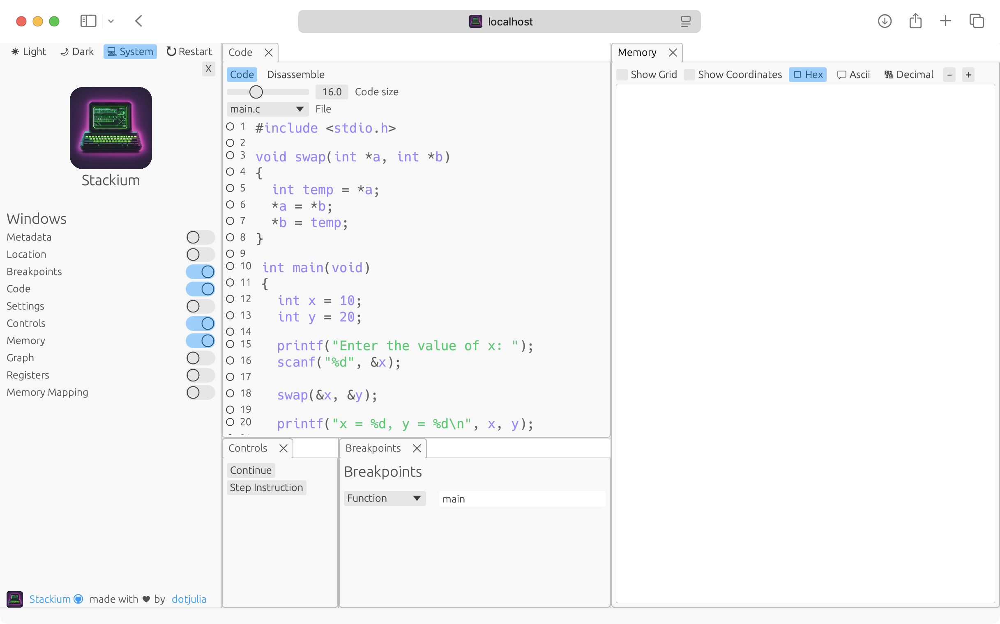

include::partials/header.adoc[]

[.text-left]
== Quick UI Overview
After following link:setup.html[[Setup\]] you should see the following UI.

On the left there is a sidebar which allows you to open different windows. You can ignore the sidebar for now.

The code window displays the code of the current file. You will use this window to set breakpoints and step through the code.

Using the controls you can step from one breakpoint to the next and the memory window will display the current state of the memory.

[.text-left]
== The example code
We will use a simple example to demonstrate how to use the debugger. The code is shown below.

[source,c]
----
#include <stdio.h>
#include <stdlib.h>

void swap(int *a, int *b)
{
  int temp = *a;
  *a = *b;
  *b = temp;
  printf("Swap done");
}

int main(void)
{
  int x = 10;
  int* y = (int*) malloc(sizeof(int));

  printf("Enter the value of y: ");
  scanf("%d", y);
  
  swap(&x, y);

  printf("x = %d, y = %d\n", x, *y);

  free(y);
  y = NULL;
  
  return 0;
}

----

[.text-left]
== Setting a breakpoint

Before we start running the program, we need to set some breakpoints. We will be able to inspect the memory of the program at those breakpoints.

[open.imgcols]
====

[open]
=====
You can set breakpoints by clicking on the circles in the left margin of the code window. A filled circle indicates a breakpoint is set.

I will set a few breakpoints in the `main` and the `swap` function. You will want to set a breakpoint at every line on which you want to stop execution.

Setting a breakpoint in a line means that the program will stop executing before executing the instructions associated with that line.
=====

====

[.text-left]
== Stepping through the program and inspecting the memory

[open.imgcols]
====

[open]
=====
To start the program, click on `Continue` in the Controls window. The program will run until it hits the first breakpoint. You can see the current line of execution highlighted in green in the code window.

In this example, the program will stop before initializing the `x` variable in the `main` function.

You can now see the current state of the memory in the Memory window. The left column shows the stack and the right column shows everything else (most commonly the heap).

All variables are displayed as boxes with their name and value. The value is by default displayed in hexadecimal.

You can zoom into the visualization by either using `Ctrl + Scroll`, the `+` and `-` buttons, dragging a box using the right mouse button or by using multi-touch gestures if you are using a touch screen or touchpad.

=====

====

Note that to simplify the visualization at the beginning, I changed the integer pointer to a stack variable.

[open.imgcols]
====

[open]
=====
By clicking `Continue` again, we can continue the execution of the program. I will stop before the `printf` call.

As we can see, the pointer `y` is now initialized and points to a memory location on the heap.

The value of `x` is displayed as `0xA` but as it is an integer, let's switch to decimal representation. We can do this by clicking on the `Decimal` button in the Memory window.
We can now see that `x` is equal to `10`.

Next, set a breakpoint before the `swap` function and click `Continue` again.
=====

====

The next two lines before the `swap` function are the `printf` and the `scanf`:

[source,c]
----
printf("Enter the value of y: ");
scanf("%d", y);
----

[open.imgcols]
====

[open]
=====

Sadly, stackium does not support input and output from stdin and stdout. Therefore, you will need to look at the console where stackium is running.

Also note, that while your program is waiting for input, the Controls window will show a loading spinner.

=====
====

[open.imgcols]
====
[open]
=====
In the terminal you will see that the program is waiting for input:

Once we enter a value (e.g. 20), the program will continue and stop at the breakpoint before the `swap` function.
=====

[source]
----
Enter the value of y:
----
====

We can now confirm that the value `y` points to is `20`.

Let's set a breakpoint in the `swap` function and click `Continue` again.

Once we enter the `swap` function, we can see that now the current stack is the `swap` function stack.

Observe that the values of `a` and `b` point to completely different memory locations as `a` points to the stack of the `main` function and `b` points to the heap.

NOTE: There exists a bug in the current version of stackium that visualizes "simple" functions confusingly. Add at least one `printf` statement (or a call to any other function) to the `swap` function to see the correct visualization.

Back in the `main` function, we can see that the values of `x` and `y` have been swapped. Now let's free the memory of `y` and observe the memory directly after the `free` call (by setting breakpoint at the beginning of the next line).

As we can see, the pointer `y` now still points to the same memory location but the value there is now different (in my case 33).
This memory location was freed and therefore `y` points to an invalid memory location.  Let's set `y` to `NULL` and continue to the last breakpoint at the return statement.

[open.imgcols]
====

[open]
=====
Stackium now realises that `y` is an invalid pointer and marks it as such.

You have now seen how to set breakpoints, step through the program and inspect the memory.

If you find any bugs or annoyances, please report them on link:https://github.com/dotjulia/stackium/issues[GitHub].
=====

====

