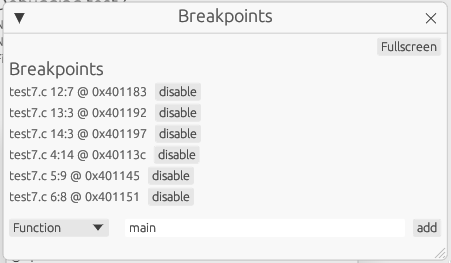
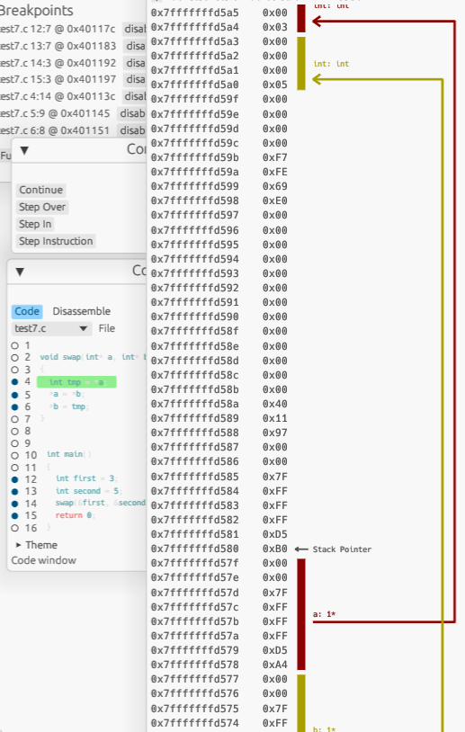

:hardbreaks:
:logotitle: Stackium
:showtitle:
:stylesheet: monospace.css
// :toc: left

[.text-center]
= Stackium
:description: An education focused debugger
:url-repo: https://github.com/dotjulia/stackium
:icons: font
:toc: preamble

++++
<link rel="stylesheet" href="https://cdnjs.cloudflare.com/ajax/libs/highlight.js/11.9.0/styles/atom-one-dark-reasonable.min.css">

++++

image:https://img.shields.io/badge/rustc-%5E1.71.1-orange.svg[] image:https://github.com/dotjulia/stackium/actions/workflows/main.yml/badge.svg[] image:https://shields.io/github/downloads-pre/dotjulia/stackium/latest/total?label=Downloads[Download,link=https://github.com/dotjulia/stackium/releases/latest] image:https://img.shields.io/github/issues/dotjulia/stackium[Issues,link=https://github.com/dotjulia/stackium/issues]

[.text-left]
== What is Stackium?
Stackium is a debugger for educational purposes. It is designed to be easy to use and to provide a good learning experience for beginners to help them understand memory management and pointer semantics in C.

[.text-center]
image::stackium_final.png[]

[.text-left]
== Launching Stackium
Optional dependencies:
- `objdump` for displaying the disassembly in the code view
[source,bash]
----
Usage: stackium [OPTIONS] <PROGRAM>

Arguments:
  <PROGRAM>  

Options:
  -m, --mode <MODE>  [default: cli] [possible values: cli, web, gui]
  -h, --help         Print help
  -V, --version      Print version
----
TIP: You can also use `stackium --help` to get more information about the options.

[.text-left]
== Building a `C` program for Stackium
Tested for `clang version 16.0.6`.

****
Use the provided `build_test.sh`: `build_test.sh <file>.c`.
****
If you do not want to use the provided script, you need to specify the following flags:

.Flags
* `-no-pie`
** disable position independent code (no ASLR)
* `-gdwarf-4`
** stackium doesn’t support dwarf-5 yet
* `-fno-omit-frame-pointer`
** stackium uses a very basic approach to build the stack trace which requires the frame pointer to be present
* `-g`
** enable debug symbols
* `-O0`
** disable optimizations

[.text-left]
== Example for Beginners
Suppose we want to debug this example program saved in file `test.c`:
[source,c]
----
void swap(int* a, int* b)
{
  int tmp = *a;
  *a = *b;
  *b = tmp;
}

int main()
{
  int first = 3;
  int second = 5;
  swap(&first, &second);
  return 0;
}
----
Let's build it using `./build_test.sh test.c` and then launch stackium in web mode: `./stackium test --mode web`.

After following the URL in the terminal, we can see the following:

image::stackium_first.png[Stackium Web Interface]

Now, click on the `Code` window and set breakpoints on all lines by clicking on the circles to the left of them:

[open.imgcols]
====
--
Breakpoints are denoted by filled circles. When the program gets to a line marked as a breakpoint it stops and you can inspect it.

You can verify that the breakpoints have been set by looking at the breakpoint window:

--
image::breakpoints.png[Breakpoints]
====

[open.imgcols]
====
Now click on continue in the controls window (sometimes in gui mode you'll need to click it twice when launching the program for the first time). You can see that the first breakpoint has been hit by the green highlight.

image::first_breakpoint.png[First Breakpoint]
====

[open.imgcols]
====
--
Open the memory view by clicking the toggle next to `Memory` in the sidebar to find out what is happening behind the scenes.

IMPORTANT: The memory view builds up over time but the GUI doesn't render new frames automatically. If the memory view doesn't seem to update, try moving the mouse cursor. GitHub Issue: https://github.com/dotjulia/stackium/issues/20

As you can see, the program allocated memory on the stack for the variable `first` and `second`. Looking at the content, you'll find that they don't have the correct value yet. This is because the program was interrupted before the first line in the main function.
--
image::stackium_startmemory.png[Memory View]
====

[open.imgcols]
====
--
Click on `continue` until we reach the swap function and you'll see that `first` and `second` now contains `3` and `4`. Before we step into the swap function, let's tick the `Lock stack start` checkbox.

It is recommended to do this for such short examples in order to get a better overview. The default behaviour of the memory view is to always try and fit the left stack column to the stack of the current function. By locking the stack start we can see that the stack of the `swap` function is appended to the end of the stack of the `main` function.

At the end there will be a screenshot of how it would have looked like if we did not lock the start of the stack to the stack of the main function.
--
--
image::stackium_integers.png[Content of first and second]
image::stackium_lockstackstart.png[Lock Stack Start]
--
====

[open.imgcols]
====
--
If we press continue now, we can see that in the swap function we have two pointers which point into the stack of the main function.

Now try to observe on your own what happens when you step through the swap function.
--

====

[open.imgcols]
====
--
If we didn't lock the stack to the main function's stack, this is what the swap function would have looked like.

As you can see, only the stack of the swap function is displayed and the pointers `a` and `b` now point to a `[stack]` section in the right column.

The right column always tries to load memory which is pointed to by variables on the stack and dynamically updates based on the pointer's values.

In this case, the stack of the main function is loaded on the right side so you can see what is going on.

We can also see that the `calling base pointer` points to the beginning of the stack of the main function.
--
image::stackium_final.png[]
====

[.text-left]
== Sidebar
[open.imgcols]
====
--
The sidebar is used to enable and disable specific windows. It can be closed by pressing the `X` button in the top right corner to get more space.

See <<windows>> for more information about the different windows.
--
[.smaller]
image::sidebar.png[Sidebar]
====

[.text-left]
[[windows]]
== Window Overview
Each window can be put into fullscreen by pressing the fullscreen button in the top right corner of the window. Using the exit fullscreen button in the top left corner the window can be minimized again.

=== Most relevant windows for beginners
[%collapsible]
.Code
=====
- See the compiled `C` program and set breakpoints
- The green highlighted line represents the current point of the program.
- Clicking on the `Disassemble` tab will display the assembly of the currently running program
=====
[%collapsible]
.Controls
====
- Continue the execution from the current breakpoint. When launching `stackium` the program is halted at the very beginning. To get to the start of the main function set a breakpoint at the first line of the main function and press `continue`
- `Continue` and `Step Instruction` are currently working.
- `Step Over` and `Step In` often results in unexpected behaviour
====
[%collapsible]
.Memory
====
[open.imgcols]
=====
--
- Displays the stack and heap of the current function
- The left column is the stack of the current function
- The right column is loaded dynamically based on the pointer values on the stack
- More information about the memory view can be found in <<memoryview>>
--
image::memory_view_example.png[Memory View]
=====
====
[%collapsible]
.Graph
====
[open.imgcols]
=====
--
- Displays all variables as a node in an interactive graph where the edges are pointers between the variables.
- Nodes can be dragged with the mouse
- This view is useful to debug data structures like linked lists or binary trees
- In this example the first `Node*` is the pointer on the `stack` pointing to the first Node on the heap. All the other nodes lie on the heap
--

=====
====

=== Other windows
[%collapsible]
.Other Windows
====
* Metadata
** Displays information like binary name, files, number of functions and number of variables.
* Location
** Displays the current location in the program
** (currently broken, use the code view instead)
* Breakpoints
** Get a list of all breakpoints
** Set breakpoints by specifying a function name or an address
* Settings
** Various settings, probably only useful for switching between light and dark mode
* Registers
** Displays the content of some registers
* Memory Mapping
** Displays all mapped memory regions
** uses **`/proc/self/maps`**
** This mapping is also used by `stackium` to determine which pointers point to valid memory

====

[.text-left]
[[memoryview]]
== Memory View
[open.imgcols]
====
--
The data is split into two columns.

The left column represents the current stack with the corresponding addresses and bytes. The highest address is at the top and the smallest at the bottom.

The current stack is always just the stack used by the currently executing function. The stack starting address can be locked by ticking the `lock stack` checkbox.

The right column displays additionally loaded memory sections which got loaded by references in the stack.

These additionally loaded sections could be heap, library code loaded by the return pointer, other parts of the stack which are not part of the left column, …
--
image::memory_view_example.png[Memory View]
====
WARNING: Variables on the right side are discovered by following pointers from the stack with the assumption that they contain meaningful data if they point to a valid memory region.
It is up to the user to confirm that variables on the heap contain the expected data.

[open.imgcols]
====
--
Variables are represented by vertical lines

Structs and arrays consist of multiple vertical lines. The first one representing the memory of the struct and all others to the right being a member variable.

Arrays consist of one line representing the whole array and additionally one for each item.

[open.imgcols]
======

[open]
=======
Pointers are represented by lines connecting the pointer to the memory it points to.

If the value of the pointer is not within a loaded section, a questionmark is drawn instead.
=======
======

--
[.smaller]

====
WARNING: The value of the pointer being within a valid memory region doesn't imply that it points to meaningful data.

WARNING: Due to optimization freed memory is often still within valid memory regions which means pointers to that memory location are still rendered. To avoid this set your pointers to `NULL` after freeing them (this is also a good way to avoid bugs).

++++

<link href="
https://cdn.jsdelivr.net/npm/medium-zoom@1.1.0/dist/style.min.css
" rel="stylesheet">

++++