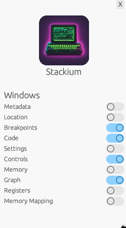

include::partials/header.adoc[]

[.text-left]
== Sidebar
[open.imgcols]
====
--
The sidebar is used to enable and disable specific windows. It can be closed by pressing the `X` button in the top right corner to get more space.

See <<windows>> for more information about the different windows.
--
[.smaller]

====

[.text-left]
[[windows]]
== Window Overview
Each window can be put into fullscreen by pressing the fullscreen button in the top right corner of the window. Using the exit fullscreen button in the top left corner the window can be minimized again.

=== Most relevant windows for beginners
This is a quick overview of windows which might be most relevant for beginners.

==== Code
- See the compiled `C` program and set breakpoints
- The green highlighted line represents the current point of the program.
- Clicking on the `Disassemble` tab will display the assembly of the currently running program

==== Controls
- Continue the execution from the current breakpoint. When launching `stackium` the program is halted at the very beginning. To get to the start of the main function set a breakpoint at the first line of the main function and press `continue`
- `Continue` and `Step Instruction` are currently working.
- `Step Over` and `Step In` often results in unexpected behaviour

==== Memory
[open.imgcols]
=====
--
- Displays the stack and heap of the current function
- The left column is the stack of the current function
- The right column is loaded dynamically based on the pointer values on the stack
- More information about the memory view can be found in link:memory_view.html[Memory View]
--
image::memory_view_example.png[Memory View]
=====

==== Graph
[open.imgcols]
=====
--
- Displays all variables as a node in an interactive graph where the edges are pointers between the variables.
- Nodes can be dragged with the mouse
- This view is useful to debug data structures like linked lists or binary trees
- In this example the first `Node*` is the pointer on the `stack` pointing to the first Node on the heap. All the other nodes lie on the heap
--
image::graph_example.png[Memory View]
=====

=== Other windows

* Metadata
** Displays information like binary name, files, number of functions and number of variables.
* Location
** Displays the current location in the program
** (currently broken, use the code view instead)
* Breakpoints
** Get a list of all breakpoints
** Set breakpoints by specifying a function name or an address
* Settings
** Various settings, probably only useful for switching between light and dark mode
* Registers
** Displays the content of some registers
* Memory Mapping
** Displays all mapped memory regions
** uses **`/proc/self/maps`**
** This mapping is also used by `stackium` to determine which pointers point to valid memory